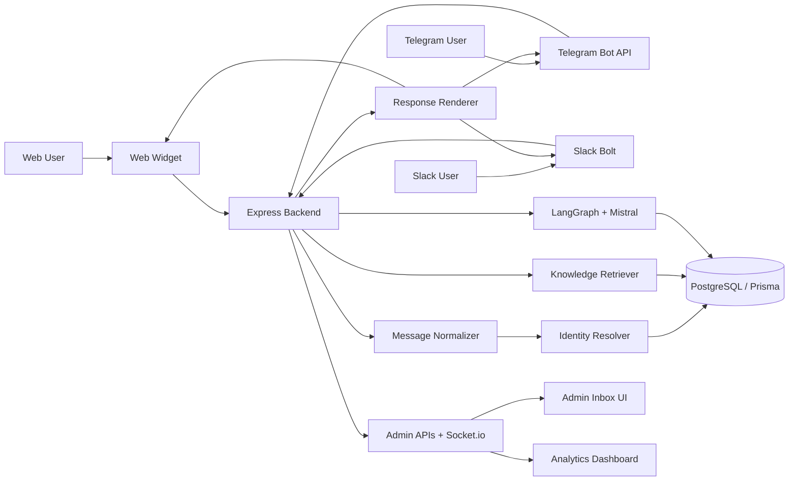

# Omnichannel AI Chatbot - Phase 1 to 4

Unified AI support platform across web + messaging channels:
- Express + TypeScript backend
- LangGraph orchestration + Mistral generation
- Next.js 14 frontend (web widget + admin inbox + analytics)
- PostgreSQL + Prisma persistence
- Telegram Bot API and Slack Bolt integration
- Channel-specific rendering (web HTML, Telegram inline keyboard, Slack Block Kit)
- Identity linking across channels
- Knowledge Base ingestion (PDF) + retrieval context (RAG-lite)
- Human takeover mode + canned responses
- Real-time unified admin inbox (Socket.io)
- Analytics API + Recharts dashboard

## Project Structure

- `apps/backend`: API, normalization, Mistral service, Prisma, Telegram/Slack webhooks
- `apps/frontend`: Web chat widget + admin inbox + analytics

## Setup

1. Create app-specific env files:
   - Copy `apps/backend/.env.example` -> `apps/backend/.env`
   - Copy `apps/frontend/.env.example` -> `apps/frontend/.env.local`
2. Install dependencies:
   - `npm install`
3. Generate Prisma client:
   - `npm run prisma:generate --workspace backend`
4. Run migrations:
   - `npm run prisma:migrate --workspace backend`
5. Start backend + frontend:
   - `npm run dev`

Frontend: `http://localhost:3000`  
Backend health: `http://localhost:4000/health`
Admin dashboard: `http://localhost:3000/admin`
Analytics dashboard: `http://localhost:3000/admin/analytics`

## Webhooks

- Telegram webhook endpoint: `POST /webhooks/telegram`
- Slack webhook endpoint (Bolt): `POST /webhooks/slack`
- WhatsApp endpoint can be added using `WHATSAPP_*` env variables (mock renderer currently supported in service layer)

## ngrok Local Testing

1. Start backend:
   - `npm run dev:backend`
2. Start ngrok tunnel on backend port:
   - `ngrok http 4000`
3. Copy your HTTPS forwarding URL from ngrok:
   - Example: `https://abcd1234.ngrok-free.app`

### Telegram setup

1. Set `TELEGRAM_BOT_TOKEN` in `apps/backend/.env`.
2. Register webhook:
   - `https://api.telegram.org/bot<TELEGRAM_BOT_TOKEN>/setWebhook?url=<NGROK_URL>/webhooks/telegram`
3. Send a message to your bot in Telegram.

### Slack setup

1. Set `SLACK_BOT_TOKEN` and `SLACK_SIGNING_SECRET` in `apps/backend/.env`.
2. In Slack app settings:
   - Event Subscriptions -> Enable Events
   - Request URL: `<NGROK_URL>/webhooks/slack`
3. Subscribe to bot events:
   - `message.channels`
   - `message.im`
4. Reinstall app to workspace, then send a message where bot is present.

### Optional WhatsApp (Cloud API) setup notes

1. Set:
   - `WHATSAPP_ACCESS_TOKEN`
   - `WHATSAPP_VERIFY_TOKEN`
   - `WHATSAPP_PHONE_NUMBER_ID`
2. Configure Meta webhook callback URL to your backend (via ngrok).
3. Verify and subscribe message events.

## Phase 3 - Admin Dashboard

- Open `http://localhost:3000/admin` to access Unified Inbox.
- New incoming Telegram/Slack/Web messages appear in real time using Socket.io.
- Use the `Human Mode` toggle:
  - `OFF` (AI mode): Mistral auto-replies
  - `ON` (Human mode): AI response is interrupted, waiting for admin manual reply
- Use canned responses chips for fast manual replies.
- Manual admin reply is dispatched to the original channel (Telegram/Slack/Web context).
- Admin API requests require `x-admin-token` and support rate limiting.
- Manual admin replies are restricted to Human Mode.

## Phase 4 - Identity Linking, RAG, Analytics

- User link endpoint: `POST /api/users/link`
  - Example:
    - `{ "email": "user@example.com", "links": [{ "channel": "telegram", "externalUserId": "123" }] }`
- Admin knowledge upload endpoint: `POST /api/admin/knowledge/upload`
  - Multipart form-data with `file` (PDF).
- Analytics endpoint: `GET /api/admin/analytics`
  - Returns channel counts, hourly volume, and average response time.
- Once a knowledge document is uploaded, chat responses automatically include retrieval context when relevant.

## Cross-channel Continuity

- Use `POST /api/admin/identity-links` to map multiple channel identities to one canonical profile.
- Once linked, AI context fetches recent profile-level history across channels (web/telegram/slack).

## Architecture Diagram

## Notes

- This is a monorepo using npm workspaces. A root `node_modules` is expected and standard.
- Never place real secrets in any `*.example` file.